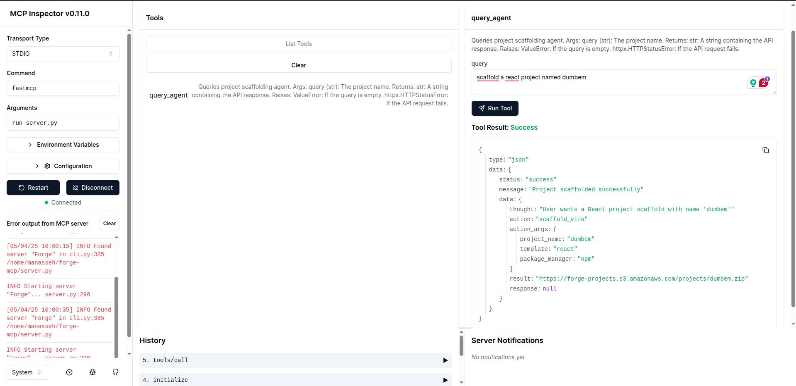

# Forge MCP Server

A Model Control Protocol (MCP) server for the Forge project scaffolding agent. This server acts as a bridge between Large Language Models (LLMs) and the Forge API, enabling AI assistants to scaffold new projects based on user requirements.



## Overview

Forge MCP Server uses the FastMCP framework to create tools that LLMs can use to interact with the Forge project scaffolding API. This allows AI assistants to generate project structures, boilerplate code, and configurations based on natural language descriptions.

## Features

- Easy integration with LLMs using the Model Control Protocol
- Connection to the Forge project scaffolding API
- Simple query interface for project generation
- Error handling and timeout management

## Prerequisites

- Python 3.13+
- Pipenv

## Installation

Clone the repository:

```bash
git clone https://github.com/believemanasseh/forge-mcp.git
cd forge-mcp
```

Install dependencies:

```bash
pipenv --python 3.13
source .venv/bin/activate
pipenv install
```

## Development

### Running the Server

```bash
fastmcp dev server.py
```

The server uses stdio for communication by default, making it compatible with various LLM integration frameworks.

### API Reference

#### `query_agent`

Sends request queries to the Forge API and returns the results.

**Parameters:**

- `query` (string): Natural language description of the project to scaffold

**Returns:**

- JSON response from the Forge API

**Example:**

```txt
query_agent("Create a Django project named deet.")
```

## Contributing

We welcome contributions to the Forge MCP Server project! Here's how you can contribute:

1. **Fork the repository** - Create your own fork of the project
2. **Create a feature branch** - `git checkout -b feature/your-feature-name`
3. **Commit your changes** - Make sure to write clear commit messages
4. **Push to your branch** - `git push origin feature/your-feature-name`
5. **Open a pull request** - Describe the changes you've made and why they should be included

### Development Guidelines

- Follow PEP 8 style guidelines for Python code
- Write docstrings for all functions, classes, and methods
- Add appropriate unit tests for new features
- Update documentation to reflect any changes

## Integration with LLMs

This MCP server can be integrated with LLMs that support the Model Control Protocol, allowing them to use the Forge project scaffolding capabilities directly.

## License

[Apache License 2.0](LICENSE)
